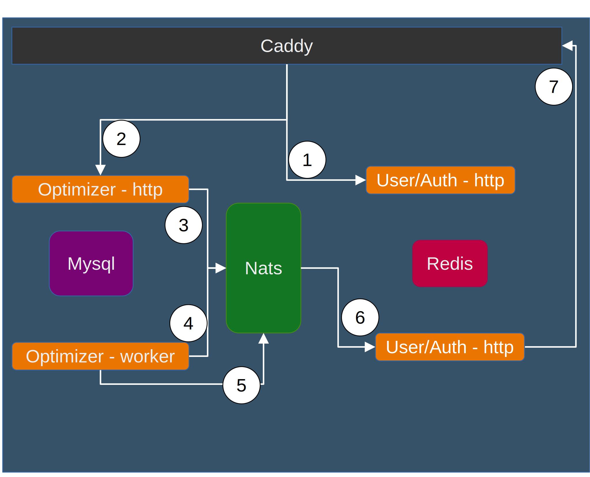

## Roadmap

1. Getway authorize request with user service
2. Then send it to opt-svc
3. opt-svc publish a message into queue
4. opt-svc worker consume the message and start optimization
5. Then publish the status of image process 
6. user service consume the message 
7. and let client (webhook, socket) know about the image

## Tech Stack

#### Client
---

#### Server
---

**Getwey:** Caddy

**User Service:** go

**Optimizer Service:** rust

**Queue:** nats

